# User Flow
## Aplikasi Absensi & Reporting SPG-TL — WOW JSM

**Tanggal:** 28 Agustus 2026

---

## 1. Alur Login (Semua Role)

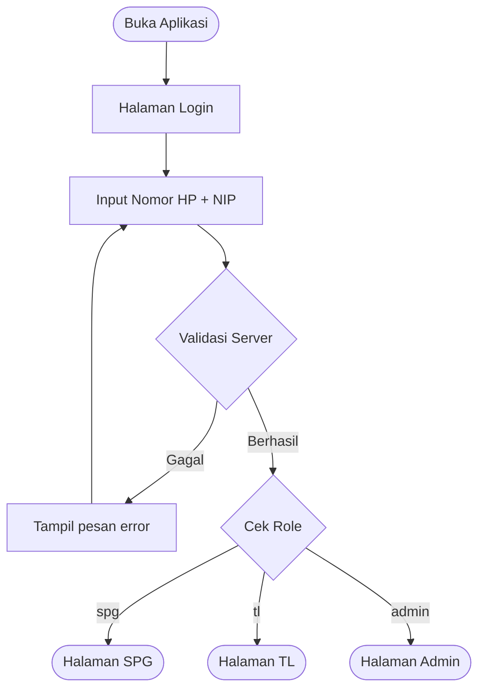

---

## 2. Alur SPG

### 2.1 Check-In

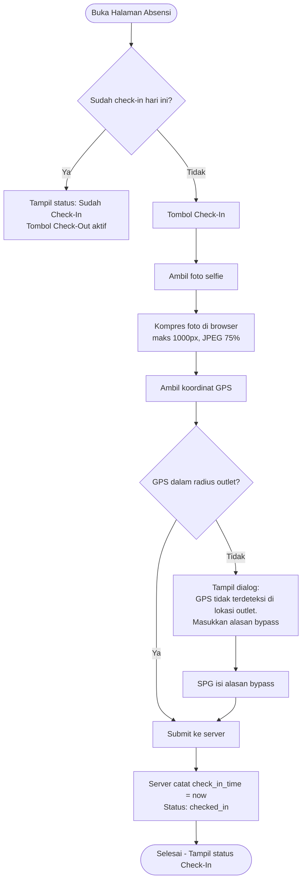

### 2.2 Input Laporan Sales Harian

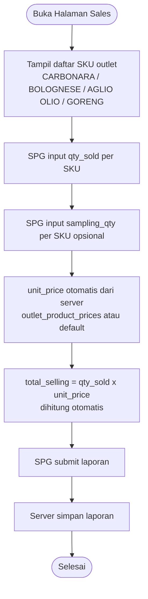

### 2.3 Input Laporan Stok Harian

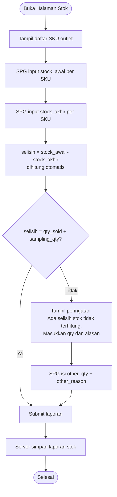

### 2.4 Check-Out

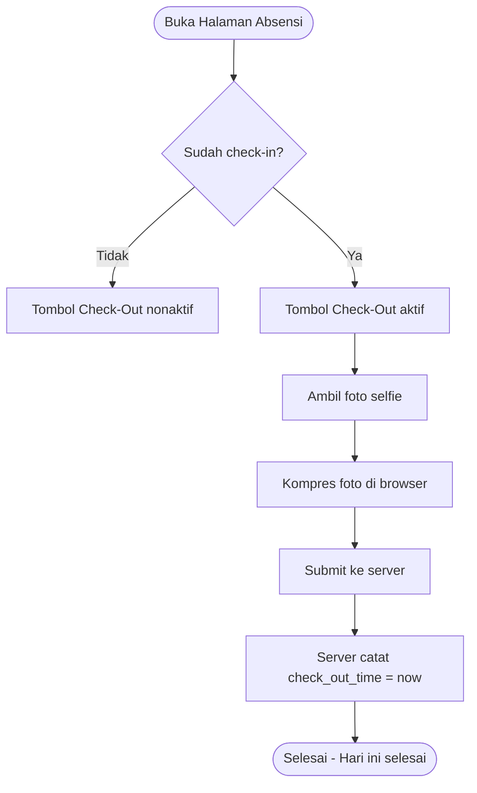

---

## 3. Alur TL

### 3.1 Dashboard Monitoring Absensi

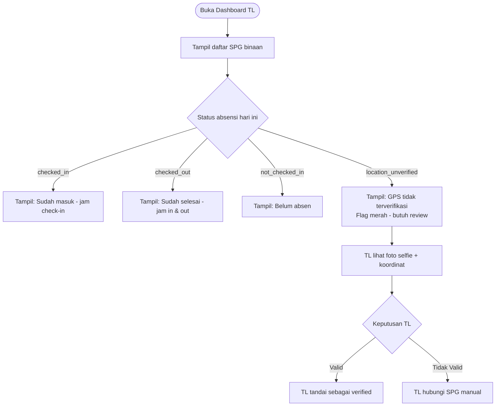

### 3.2 Set Harga SKU per Outlet

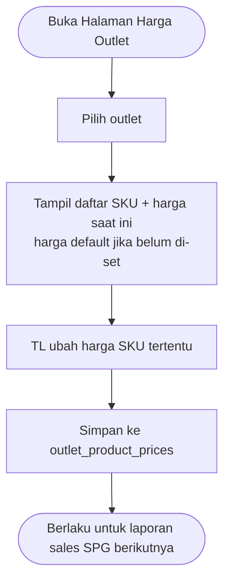

---

## 4. Alur Admin

### 4.1 Import & Sync Data dari Excel

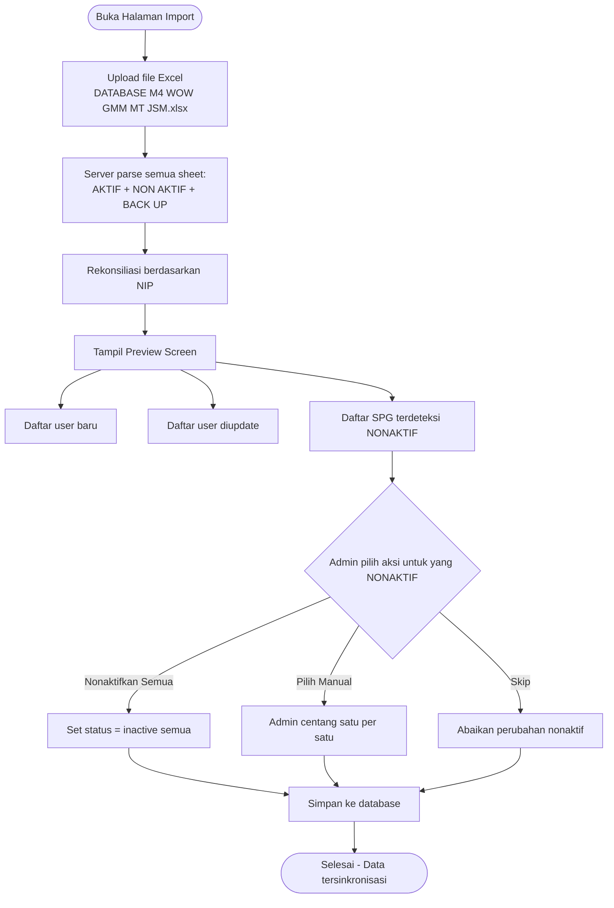

### 4.2 Manajemen User Manual

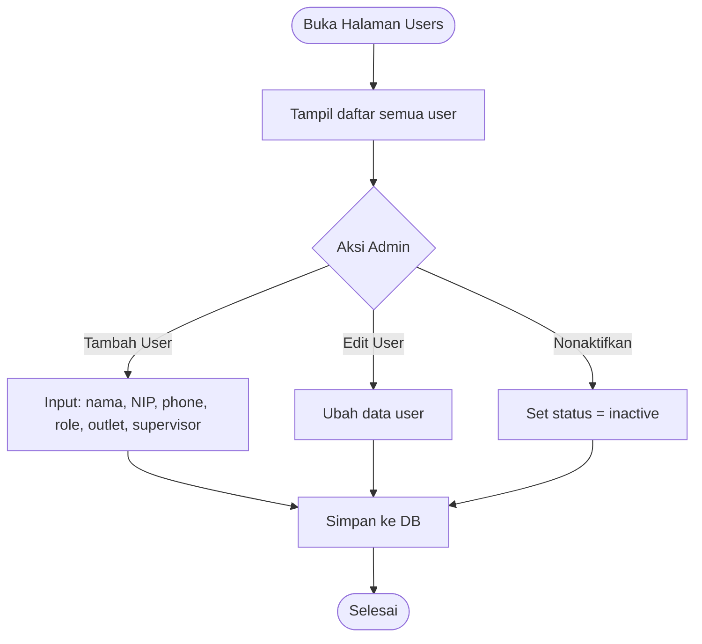

### 4.3 Manajemen Outlet & SKU

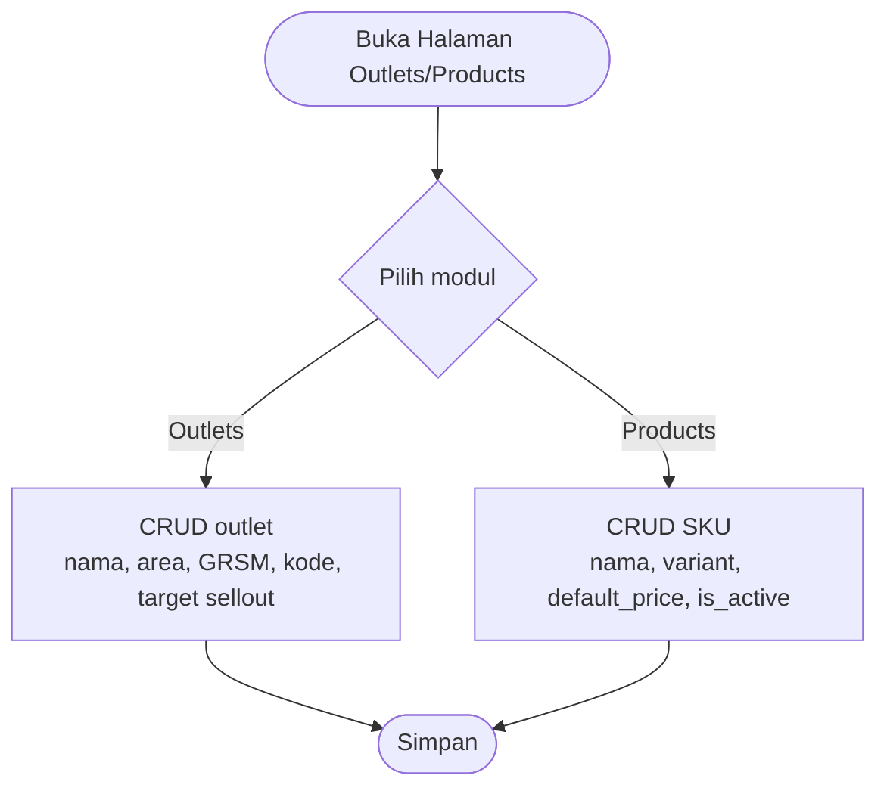

### 4.4 Export Data

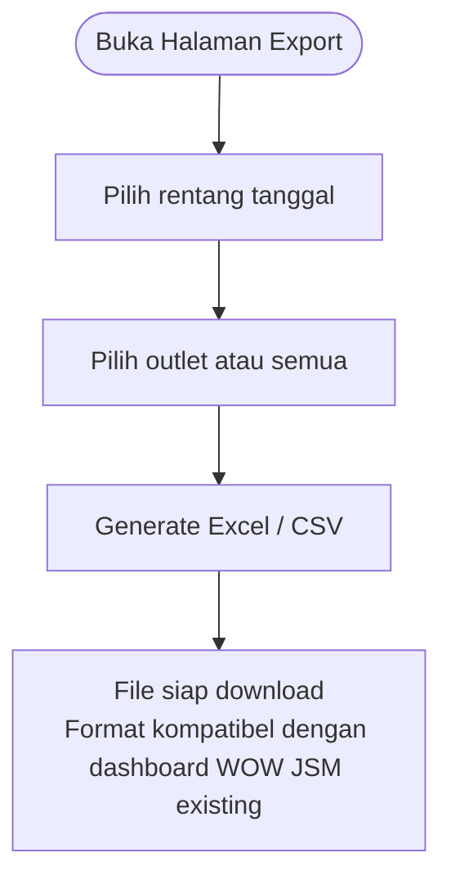

---

## 5. Ringkasan Status per Entitas

### Status Absensi (`attendance.status`)
| Status | Kondisi |
|---|---|
| `not_checked_in` | Belum absen |
| `checked_in` | Sudah check-in (belum check-out) |
| `checked_out` | Check-in & check-out selesai |

### Status Laporan (`daily_sales_reports.status` & `daily_stock_reports.status`)
| Status | Kondisi |
|---|---|
| `approved` | Selalu — laporan langsung final saat submit (tanpa pending/approved/rejected) |

### Status User (`users.status`)
| Status | Kondisi |
|---|---|
| `active` | SPG/TL aktif bertugas |
| `inactive` | Resign/nonaktif — data historis tetap tersimpan |
